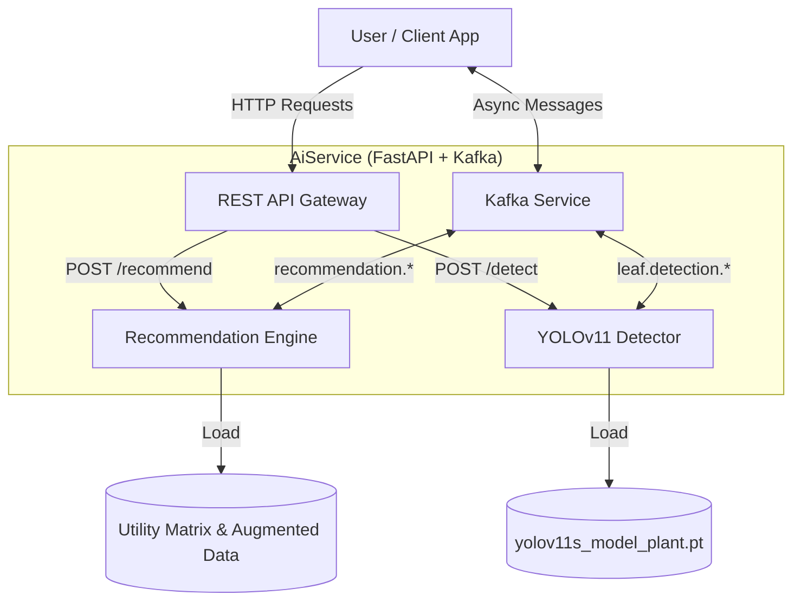

# AiService Technical Report

## Overview
The **AiService** is a microservice designed for the Tomato Irrigation Project. It provides intelligent analysis through two primary modules:
1.  **Recommendation System**: Analyzes environmental conditions (Temperature, Humidity, Soil Moisture, etc.) to assess suitability and provide actionable irrigation/fertilization advice.
2.  **Leaf Disease Detection**: Uses a YOLOv11 Computer Vision model to identify diseases on tomato leaves.

The service is accessible via **REST API** (FastAPI) and asynchronously via **Kafka**.

## Architecture



## REST API Endpoints

### 1. Recommendation
**Endpoint:** `POST /recommend`
**Description:** Evaluates climatic conditions against the Utility Matrix.

**Input (JSON):**
```json
{
  "stage": 1,
  "temperature": 35.0,
  "humidity": 40.0,
  "soil_moisture": 30.0,
  "nitrogen": 140,
  "phosphorus": 70,
  "potassium": 200,
  "ph": 6.5,
  "solar_radiation": 600,
  "wind_speed": 5.0
}
```

**Output (JSON):**
```json
{
  "prediction": "UNSUITABLE",
  "confidence": 92.5,
  "is_suitable": false,
  "recommendations": [
    "DECREASE Temperature [_ C] by 5.00 (Ideal: 30.00)",
    "INCREASE Humidity [%] by 20.00 (Ideal: 60.00)"
  ]
}
```

### 2. Leaf Detection
**Endpoint:** `POST /detect`
**Description:** Detects diseases in an uploaded image.

**Input:** `multipart/form-data` (File upload)

**Output (JSON):**
```json
{
  "status": "Diseased: Leaf_mold",
  "detections": [
    {
      "class": "Leaf_mold",
      "confidence": 0.88,
      "bbox": [57, 19, 203, 243]
    }
  ]
}
```

## Kafka Topics

The service listens to request topics and publishes to response topics.

| Function | Request Topic | Response Topic |
| :--- | :--- | :--- |
| **Leaf Detection** | `leaf.detection.request` | `leaf.detection.response` |
| **Recommendation** | `recommendation.request` | `recommendation.response` |

### Leaf Detection Payload
**Request:** `{"id": "req-1", "image_path": "/path/to/image.jpg"}`
**Response:** Same JSON structure as REST API, wrapped in `{"status": "success", "analysis": ...}`

### Recommendation Payload
**Request:**
```json
{
  "id": "req-2",
  "data": {
    "stage": 1,
    "temperature": 35.0,
    ...
  }
}
```
**Response:** Same JSON structure as REST API, wrapped in `{"status": "success", "result": ...}`
